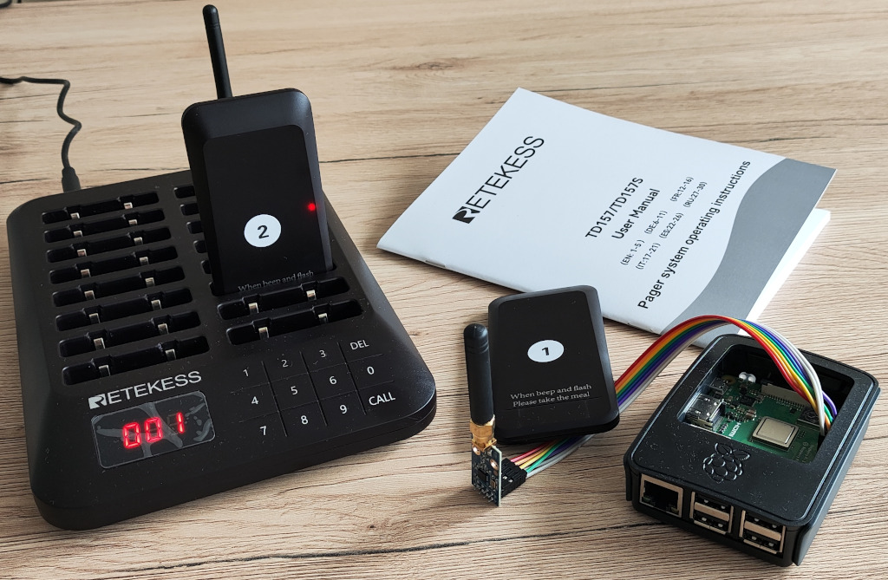
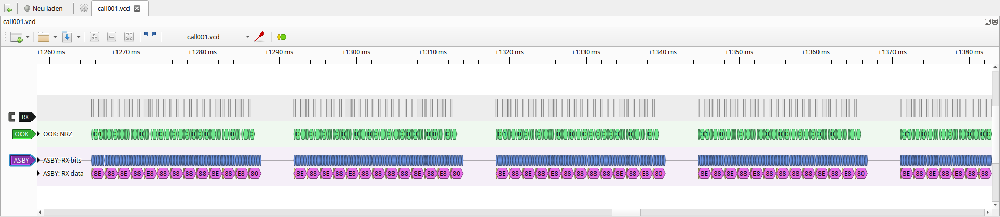
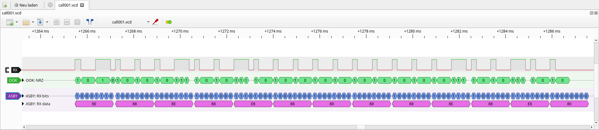

# Pagercall

Call a *Retekess* TD157 pager using *Raspberry PI* and a CC1101 transceiver.



This repo comes with two command line applications, `pagercall` and `airsniffer`.
The first is the actual application to call the pager.
The latter is a utility tool, to trace raw signals received by the transceiver.
It was used to figure out the frames that must be sent to the pager, to make it call 
(by sniffing the data sent by the original *Retekess* keyboard).

## Prerequisits

### Hardware-Connection


|CC1101 |Raspberry Pi        |
|-------|--------------------|
|VDD    | 3.3V (Pin 1 or 17) |
|SI     | MOSI (Pin 19)      |
|SO     | MISO (Pin 21)      |
|CSn    | CE0 (Pin 24)       |
|SCLK   | SCLK (Pin 23)      |
|GDO0   | Not used           |
|GDO2   | GPIO25 (Pin 22) for Airsniffer; Not used by Pagecall |
|GND    | Ground             |

Note: We use SPI0 with CS0 of *Raspberry PI*.


### WiringPi

It is recommended to build *WiringPi* from the source.
Otherwise you may get linker errors, later!

```
git clone https://github.com/WiringPi/WiringPi.git
cd WiringPi/
./build debian
mv debian-template/wiringpi_3.16_arm64.deb ./
sudo apt install ./wiringpi_3.16_arm64.deb
```

Headers will be installed to `/usr/include`.
A shared library can be found at `/usr/lib/libwiringPi.so`.


## Build

```
mkdir build
cd build
cmake ..
make
```


## Use

### Pagercall

```
Usage: pagercall
 [--help] [--version] [-k <ID>] [-p <ID>]

Options:
  --help                    Print help and exit
  --version                 Print version and exit
  -k, --keyboard=<ID>       ID of keyboard (1 .. 999)
  -p, --pager=<ID>          ID of pager (1 .. 999)
```


### Airsniffer

Program will run for 30 seconds and terminate automatically.
So start the program and send out the data you want to capture.
It will output the received signal as a  [value-change-dump](https://en.wikipedia.org/wiki/Value_change_dump) (VCD) 
that can be processed by [PulseView](https://sigrok.org/wiki/PulseView).

```
./airsniffer > capture.vcd
```

In folder `doc` you find a file [call_td157-274-1.vcd](doc/call_td157-274-1.vcd) that was created like this.
It is the capture of the data sent by Retekess keyboard (id 274) to pager 1 to make it ring (action 4).

You can use *PulseView* to open that file.
(Note: On Linux you can install *PulseView* with `apt install pulseview`)

The following image shows an excerpt of the captured data.
The keyboard sends the "call telegram" multiple times, with 5ms delay in between.


*PulseView* provides the ability to add so called protocol decoders to examine the data in detail.
The image shows an single telegram.


There is a OOK decoder, that marks the ON pulses as a '1' and the OFF pulses as a '0' bit (shown in green).
This is just a nice gimmick but does not provide more information than obviously.
However it can help us to decode the signal manually.
In OOK, bits are encoded into **symbols** as follows: 

- Short on, long off corresponds to a `0`
- Long on, short off corresponds to a `1`

With a closer look to the signal we realize that a long period lasts three times as a short period.
So a symbol - which is always composed of a short and a long perdiod - is given by 4 samples.

With that in mind, we can already start to decode the signal, manually.
However, in the `addons/sigrok-decoder` folder is a so called *ASBY* protocol decoder. *ASBY* stands for "asynchronous bytes" and is a patched version of *UART*.
After you installed that decoder (as mentioned in the [readme](addons/sigrok-decoder/README.md)) you can use it to decode
the signal more meaningful. I used a baudrate of 4800 bps and msb-first bitorder to get the shown data.
4 bits read by *ASBY* (shown in blue) represents a *symbol* and is either:

- 1000 (0x8), which correspnds to a `0`
- 1110 (0xE), which correspons to a `1`

So if you look at the bytes (shown in purple), you see a sequence of (A) which corresponds to the bits (B) and defines (C) the ID of keyboard, pager and action.

```
A: 8E 88 8E 88 E8 88 88 88 88 8E 88 E8 8_
B: 01 00 01 00 10 00 00 00 00 01 00 10 0
C: [--keyboard--] [----pager---] [action]
```

Reading these three lines from bottom up, you see what *pagecall* does. 
It takes the given keyboard-, pager- and action-id (C),
compose the code-bits (B), and endoces it (A).
Finally the encoded data is sent, and the pager rings.
